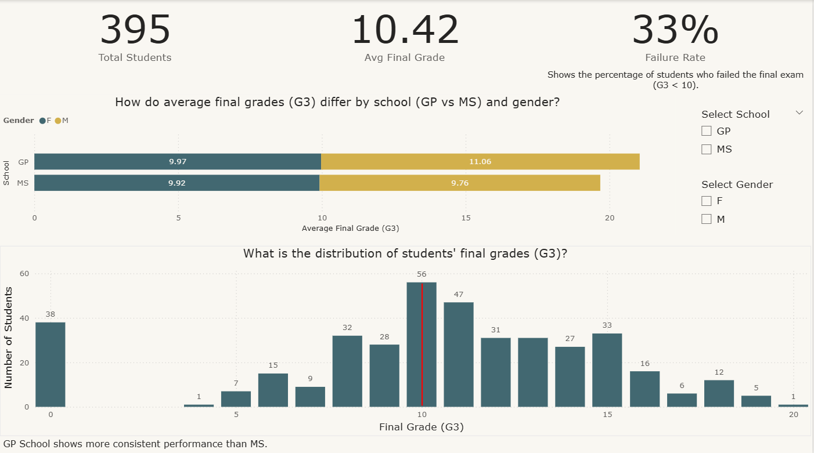
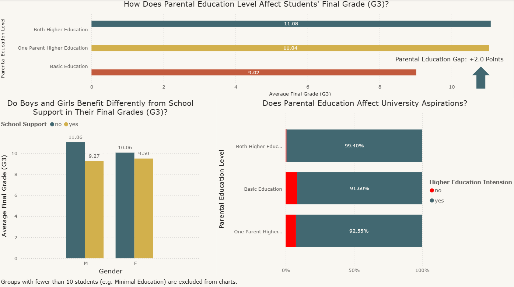
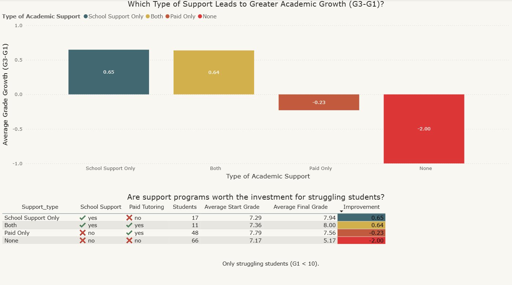

# Student Performance Strategy: From Data to Policy

## 📋 Project Overview

This project bridges the gap between **Educational Management theory** and **Data Analytics**.  
Using a student performance dataset, I built an end-to-end analysis pipeline (**SQL + Power BI**) to answer a critical question:

**Where should a school invest its limited budget to improve student outcomes?**

Unlike standard data projects that focus only on *what happened*, this analysis emphasizes **why it matters** and **what to do next**.

### 👤 Author's Background
- **Domain Expertise:** B.A. in Educational Management (Applied Bourdieu’s Cultural Capital & Equity frameworks)
- **Technical Skills:** SQL (data logic & extraction), Power BI (visualization & storytelling)

---

## 📊 The Interactive Dashboard

SQL insights were translated into a **4-page interactive Power BI report** designed for school administrators.

*(Note: The `.pbix` file is included in this repository.)*

---

### 1️⃣ Executive Overview
A high-level snapshot of overall school performance, highlighting grade distribution across **gender** and **school type (GP vs. MS)**.

---

### 2️⃣ Equity Analysis (Cultural Capital)
This page tests **Bourdieu’s Cultural Capital theory**.

The data confirms a strong inequality pattern:  
Students with higher-educated parents score **~2.0 points higher** on average.

*(Groups with statistically insignificant sample sizes were excluded for accuracy.)*

---

### 3️⃣ ROI Analysis (Most Critical Finding)
This analysis directly informs **budget allocation decisions**.

- **Paid tutoring alone:** ❌ Ineffective (**–0.23 grade growth**)  
- **Free school support:** ✅ Highest impact (**+0.65 grade growth**)

---

### 4️⃣ Early Warning System
A practical decision-support tool for counselors.

Using a **custom SQL risk formula**, this dashboard flags at-risk students *before* final failure occurs.

---

## 🛠️ Technical Implementation

### Data Source
- **Dataset:** Student Performance (Math Course)
- **Volume:** 395 records, 33 attributes
- **Tools:** PostgreSQL, Power BI Desktop

### SQL Logic & Key Findings
Five targeted SQL queries were written to extract actionable insights.  
Raw `.sql` files are available in the `sql/` directory.

| Analysis | Key Insight | Recommendation |
|--------|------------|----------------|
| **Cultural Capital** | Parental education is the strongest predictor (**~2-point gap**). | Launch mentorship programs for first-generation students. |
| **Gender Gap** | Girls respond **+0.50 better** to school support programs. | Expand support capacity for female students. |
| **School Equity** | GP School is consistent; MS School shows extreme inequality. | Replicate GP’s equity-focused policies in MS School. |
| **ROI (Budget)** | School support (**+0.65**) vastly outperforms paid tutoring (**–0.23**). | Stop promoting paid tutoring as a standalone solution. |
| **Risk Algorithm** | `3 failures + G1 < 7` → near-100% final failure rate. | Apply SQL risk scoring by Week 2 of the semester. |

---

## 🧠 Analyst Note: Why This Matters

The most surprising insight was the **negative effect of paid tutoring** when isolated.

Contrary to intuition, tutoring alone can create a *false sense of progress*.  
The real performance gains come from **structured school-based educational support**.

This finding can **save budget**, **improve equity**, and **prevent early student failure**.

---

## 📬 Connect

If this project sparked your interest or you want to discuss the SQL logic or policy implications:

**Mohammad Yaqoobi**  
Data Analyst | Educational Management Background  

🔗 [LinkedIn](https://www.linkedin.com/in/mohammad-yaqoobi/)
