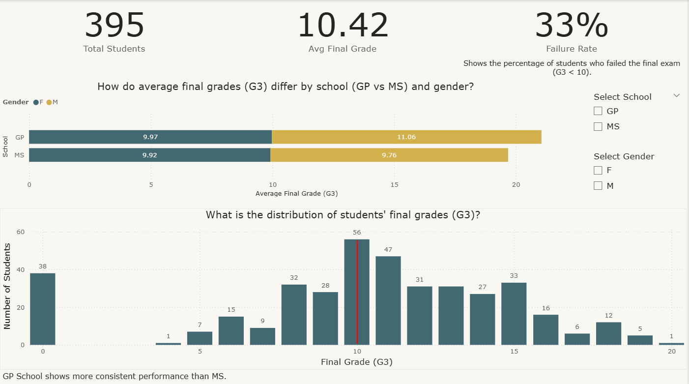
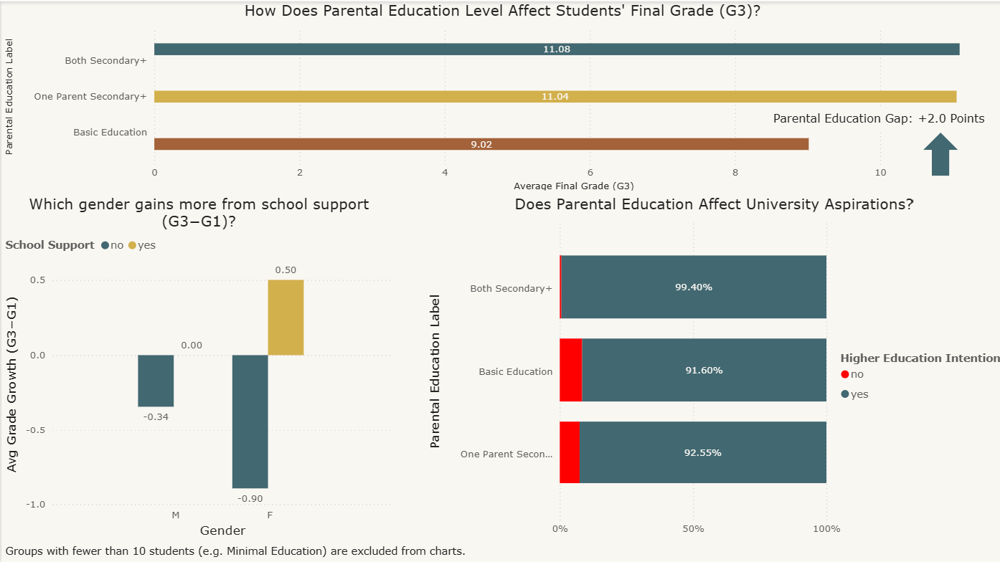
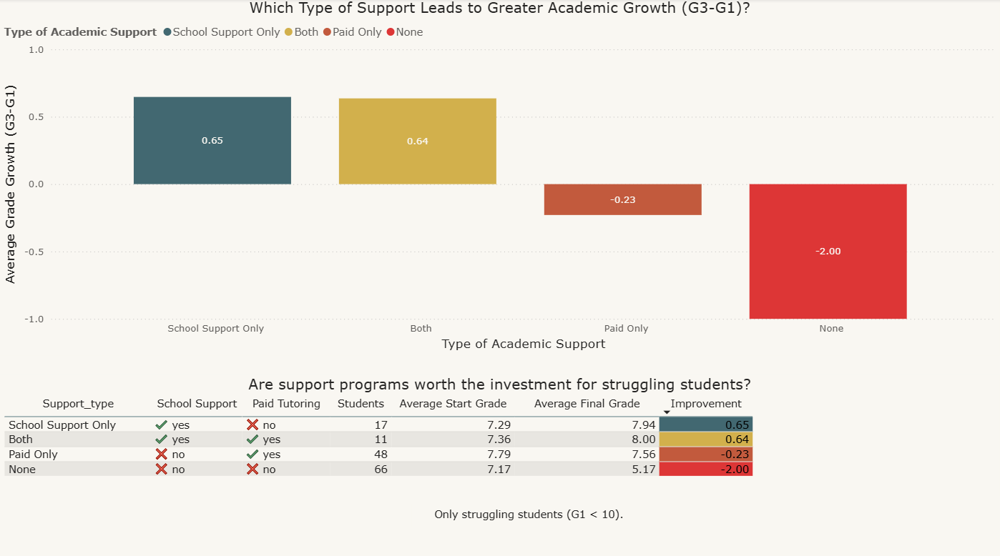
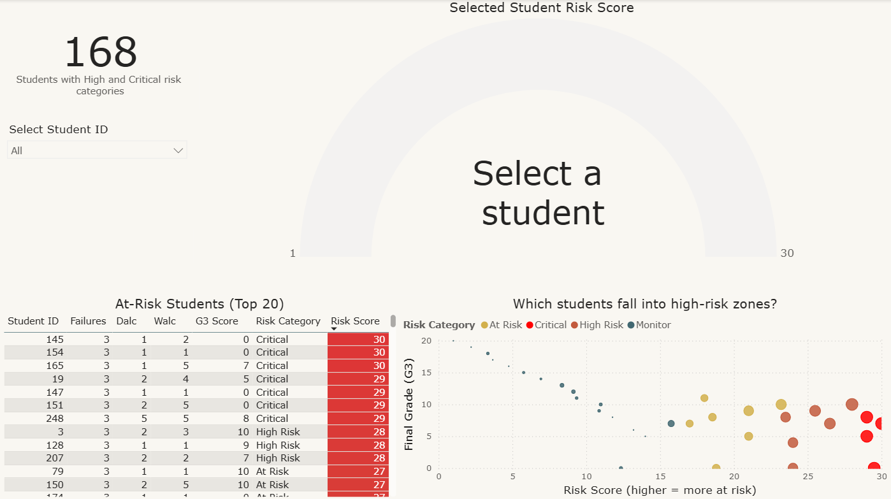

# 📊 Student Performance Strategy: From Data to Policy

## 📋 Project Overview

This project bridges **Educational Management theory** and **Data Analytics**. Using the UCI Student Performance dataset (Math course), I built an end-to-end analysis pipeline (**SQL + Power BI**) to explore one practical question:

> **Where might a school direct limited support resources to improve student outcomes?**

Unlike projects that stop at *what happened*, this analysis focuses on *why it matters* and *what a decision-maker could do next*, while being honest about what observational data can and cannot prove.

### 👤 Author's Background
- **Domain Expertise:** B.A. in Educational Management (applies Bourdieu's Cultural Capital & equity frameworks)
- **Technical Skills:** SQL (data logic & extraction), Power BI (visualization & storytelling), Excel

---

## ⚠️ Scope & Interpretation Note

This is an **observational** dataset. All findings describe **associations, not causation**. Support programs (school support / paid tutoring) are typically assigned to students who are *already struggling*, which introduces **selection bias**: raw grade comparisons make support look "harmful" simply because weaker students receive it. To reduce this, the ROI analysis (Page 3) controls for a low starting point (G1 < 10) and measures **growth (G3 − G1)** instead of grade level. Read the findings with that framing in mind.

---

## 📊 The Interactive Dashboard

The SQL insights were translated into a **4-page interactive Power BI report** for school administrators. *(The `.pbix` file is included in this repository.)*

### 1️⃣ Executive Overview
A high-level snapshot of performance: 395 students, average final grade **10.42**, failure rate **33%** (G3 < 10). Grades are broken down by **gender** and **school (GP vs MS)**. GP shows more consistent performance than MS.

> **Data note:** 38 students have G3 = 0. These are most likely drop-outs / no-shows rather than true zeros, and they pull all averages down. Interpret means accordingly.

### 2️⃣ Equity Analysis (Cultural Capital)
This page tests **Bourdieu's Cultural Capital theory** using parental education as a proxy.

Students with at least one parent with **secondary-or-higher education** score **~2.0 points higher** on average (11.08 vs 9.02). Interestingly, having *one* such parent (11.04) is nearly identical to having *two* (11.08), suggesting a **threshold effect** rather than a linear "more is better" pattern.

> **Definition:** Here "higher parental education" means `Medu/Fedu >= 3` (secondary education or above). Groups with fewer than 10 students (e.g. Minimal Education) were excluded for reliability.

### 3️⃣ ROI Analysis (Most Important Finding)
Focused **only on struggling students** (G1 < 10) and measured as grade growth (G3 − G1):

| Support type | Students | Growth (G3 − G1) |
|---|---|---|
| School Support Only | 17 | **+0.65** |
| Both | 11 | +0.64 |
| Paid Only | 48 | −0.23 |
| None | 66 | **−2.00** |

**Key reading:** School-based support is associated with the strongest growth. Notably, paid tutoring alone (−0.23) still **outperforms no support at all by ~1.8 points** (−2.00), so it is not "harmful", it simply prevents decline rather than driving improvement. School support is where the real gains appear.

> **Caveat:** The school-support groups are small (n = 17 and n = 11), so this finding is suggestive, not conclusive. It should be validated on a larger sample before driving budget decisions.

### 4️⃣ Early Warning System
A decision-support tool for counselors. A custom SQL risk score flags at-risk students *before* final failure. **168 students** fall into High or Critical risk categories.

> **Consistency note:** The core SQL risk score uses `failures * 5 + (20 - G1)`. The dashboard additionally displays alcohol indicators (Dalc/Walc) as context columns; these are shown for the counselor's judgment and are not part of the ranking formula.

---

## 🛠️ Technical Implementation

### Data Source
- **Dataset:** UCI Student Performance (Math course)
- **Volume:** 395 records, 33 attributes
- **Tools:** MySQL, Power BI Desktop

### Data Dictionary (key fields)
| Field | Meaning |
|---|---|
| `school` | GP or MS |
| `sex` | F / M |
| `Medu` / `Fedu` | Parent education, 0=none … 3=secondary, 4=higher |
| `studytime` | Weekly study time (1–4) |
| `failures` | Past class failures (0–4) |
| `schoolsup` | Extra school support (yes/no) |
| `paid` | Extra paid classes (yes/no) |
| `higher` | Wants higher education (yes/no) |
| `G1`, `G2`, `G3` | Period 1 / 2 / final grade (0–20) |
| `Dalc` / `Walc` | Workday / weekend alcohol use (1–5) |

### SQL Logic & Key Findings
Five targeted queries extract the insights below. Raw `.sql` files are in the `sql/` directory.

| Analysis | Key Insight (association) | Suggested Action |
|---|---|---|
| **Cultural Capital** | Parental education is the strongest predictor (~2-point gap); benefit appears as a threshold (one parent ≈ two). | Pilot mentorship for first-generation students. |
| **Gender & Support** | Both genders with support score lower in raw terms (selection effect); the gap is smaller for girls. Not evidence that girls "respond better". | Measure support as *growth*, not level, before targeting by gender. |
| **School Equity** | GP is consistent; MS shows wider spread. | Study which GP practices are transferable to MS. |
| **ROI (Budget)** | For G1 < 10, school support (+0.65) > paid tutoring (−0.23) > none (−2.00). Small n. | Prioritize school-based support; validate on more data. |
| **Risk Algorithm** | High failures + low G1 strongly associates with final failure. | Run SQL risk scoring by Week 2 of the semester. |

---

## 🧠 Analyst Note: Why This Matters

The most useful takeaway is that **structured, school-based support is associated with real grade growth for struggling students**, while paid tutoring alone mostly prevents decline. Because this is observational data with small support groups and possible selection bias, these are **directional signals to test**, not proven policy. Framed honestly, they can still guide *where to run a controlled pilot* — which is exactly how good analytics informs budget decisions.

---

## 📬 Connect

**Mohammad Yaqoobi** — Data Analyst | Educational Management Background

🔗 [LinkedIn](https://www.linkedin.com/in/mohammad-yaqoobi/)
